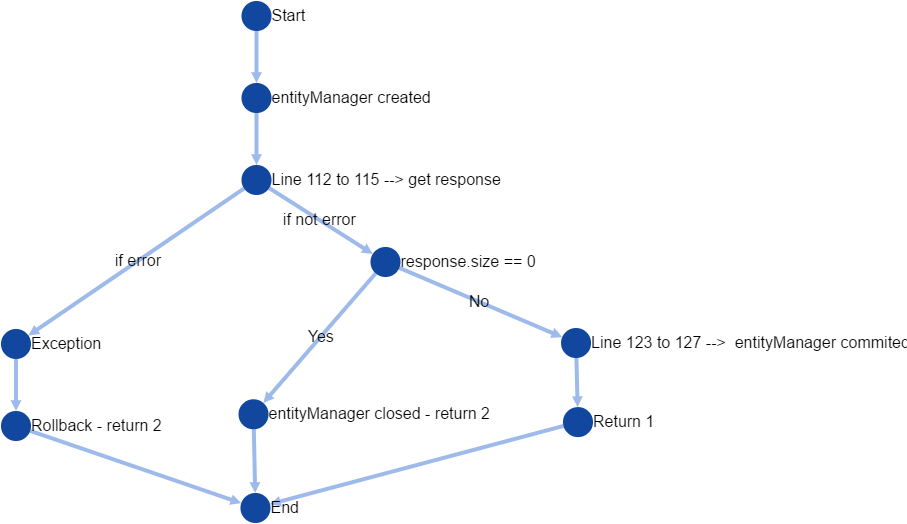
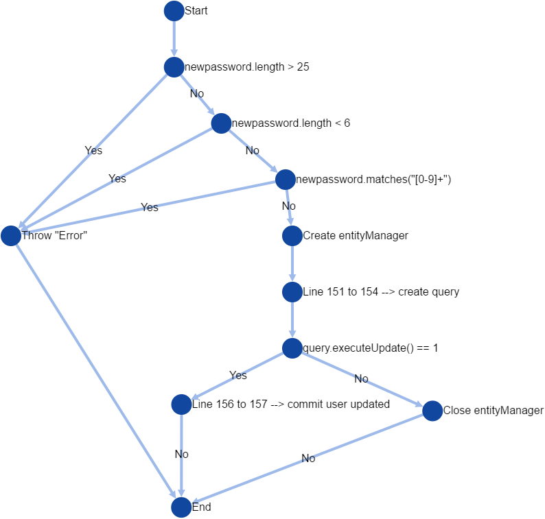
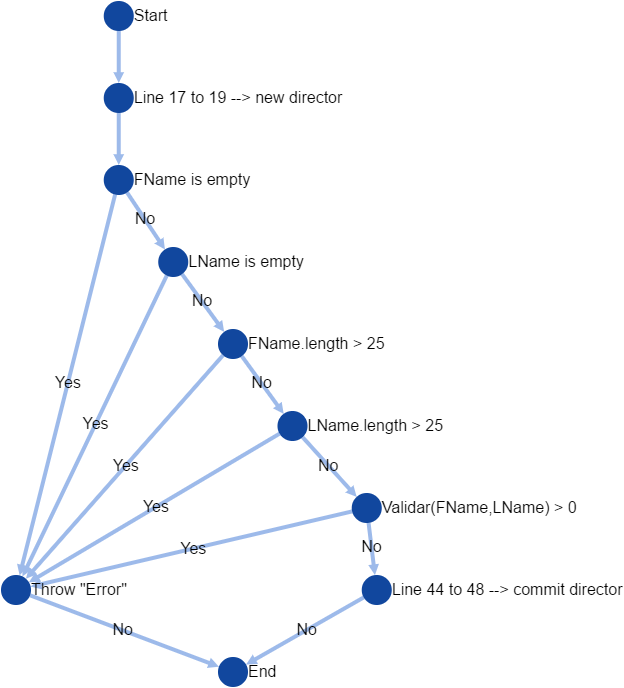
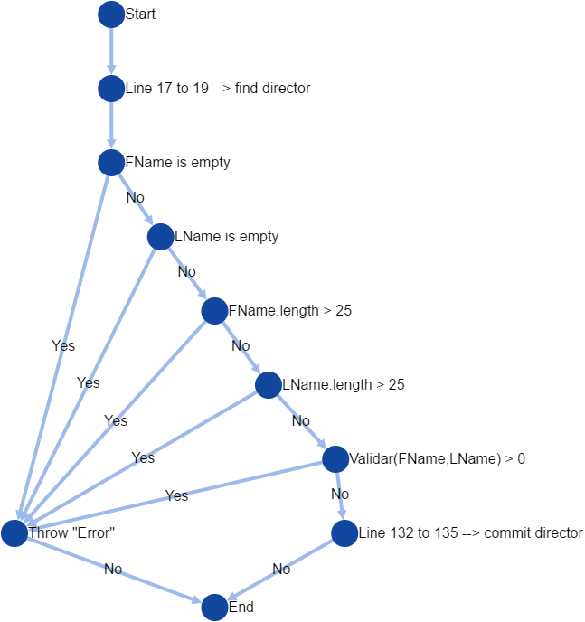
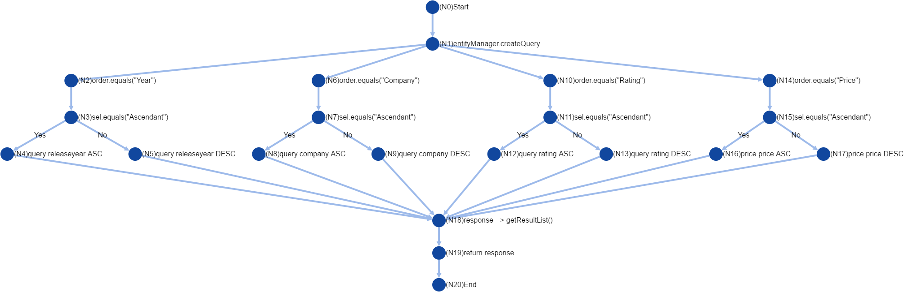

.. default-role:: code

=============================================================
Robot Framework Project 2nd version by Pablo Sanabria and Juan Diego Diaz
=============================================================

.. contents:: Table of contents:
   :local:
   :depth: 3

Introduction
============

In this opportunity, we will use graph and logic coverage in methods that
we used in the 1st report and in some new methods as well.

About this project
------------------

VideoClub is a JAVA application built using the MVC architecture.
It consists in a store to sell videogames and movies. It was developed
in Bolivia for students from Bolivian Catholic University "San Pablo" from Cochabamba.

Project application
-------------------

We embed a jar with robot framework in our application to automate the testing process.

To build this project you need to use the following command::

    >gradle build

To run this project you need to use the following command::

    >gradle run

To test this project you need to use the following command::

    >gradle runTest

Test Cases
----------

Client Controller
..................

This controller is in charged of create and delete clients who are going to buy videogames and movies.

For this controller we stablished the application of graph coverage by nodes. The test case ahead cover
all the possibilities for code traces.

**Graph for createClient Method:**

**Graph for deleteClient Method:**

.. code:: robotframework

   *** Settings ***
   Library  bo.edu.ucbcba.videoclub.controller.ClientController  WITH NAME  client

   *** Variables ***
   ${FIRST_NAME TOO LONG}   First Name is too long, must have less than 25 characters
   ${FIRST_NAME TOO SHORT}  First Name is too short, must have more than 2 characters
   ${FIRST_NAME BLANK}      First Name can't be blank
   ${LAST_NAME TOO LONG}    Last Name is too long, must have less than 25 characters
   ${LAST_NAME TOO SHORT}   Last Name is too short, must have more than 2 characters
   ${LAST_NAME BLANK}       Last Name can't be blank
   ${CI TOO LONG}		        CI can't have more than 10 characters
   ${CI TOO SHORT}		      CI can't have less than 7 characters
   ${CI BLANK}              CI can't be blank
   ${ALREADY CLIENT}		    Already exist a Client with CI:
   ${BLANK}

   *** Test Cases ***
   Creating client with blank first name should fail
       Create client with invalid first name   ${BLANK}    ${FIRST_NAME BLANK}

   Creating client with long first name should fail
       Create client with invalid first name   jhonsnowrickrobotclarkkenthor   ${FIRST_NAME TOO LONG}

   Creating client with short first name should fail
       Create client with invalid first name   k   ${FIRST_NAME TOO SHORT}

   Creating client with blank last name should fail
       Create client with invalid last name    ${BLANK}    ${LAST_NAME BLANK}

   Creating client with long last name should fail
       Create client with invalid last name    hawkingsnowrickrobotclarkkenthor    ${LAST_NAME TOO LONG}

   Creating client with short last name should fail
       Create client with invalid last name    D   ${LAST_NAME TOO SHORT}

   Creating client with blank CI should fail
       Create client with invalid CI  ${BLANK}    ${CI_BLANK}

   Creating client with long CI should fail
       Create client with invalid CI  12929388177    ${CI TOO LONG}

   Creating client with short CI should fail
       Create client with invalid CI  123    ${CI TOO SHORT}

   Creating client with valid information
       ${clients} =    Count clients
       Create client  1299456745  juan_d  perez  nowhere
       ${clients_new} =    Count clients
       ${diff} =   Evaluate    $clients_new-$clients
       Should Be Equal As Integers     ${diff}  1

   Creating client already exists should fail
       Create client duplicated  111111114  ${ALREADY CLIENT}

   Delete non existent client
       ${response} =   client.deleteClient    123
       Should Be Equal As Integers    ${response}     2

   Delete existent client
       Create client  1299456746  juan_d  perez  nowhere
       ${clients} =    Count clients
       ${response} =   client.deleteClient    1299456746
       Should Be Equal As Integers    ${response}     1
       ${clients_new} =    Count clients
       ${diff} =   Evaluate    $clients_new-$clients
       Should Be Equal As Integers     ${diff}  -1

   *** Keywords ***
   Create client with invalid first name
       [Arguments]    ${firstname}    ${error}
       ${message} =  Run Keyword And Expect Error	*  client.create  12345678  ${firstname}  hawking  nowhere
       log  ${message}
       Should Be Equal  ${message}  ValidationException: Validation error: ${error}

   Create client with invalid last name
       [Arguments]    ${lastname}    ${error}
       ${message} =  Run Keyword And Expect Error  *  client.create  12345678  jhon_doe  ${lastname}  nowhere
       log  ${message}
       Should Be Equal  ${message}  ValidationException: Validation error: ${error}

   Create client with invalid CI
       [Arguments]    ${ci}    ${error}
       ${message} =  Run Keyword And Expect Error	*  client.create  ${ci}  jhon_doe  hawking  nowhere
       log  ${message}
       Should Be Equal  ${message}  ValidationException: Validation error: ${error}

   Create client
       [Arguments]  ${ci}  ${firstname}  ${lastname}  ${address}
       ${message} =  client.create  ${ci}  ${firstname}  ${lastname}  ${address}
       log  ${message}
       Should Be Equal  ${message}  ${None}

   Create client duplicated
       [Arguments]  ${ci}  ${error}
       deleteClient    ${ci}
       client.create  ${ci}  jhon_doe  hawking  nowhere
       ${message} =    Run Keyword And Expect Error  *  client.create  ${ci}  jhon_doe  hawking  nowhere
       log  ${message}
       Should Be Equal  ${message}  ValidationException: Validation error: ${error} '${ci}'

   Count clients
       ${clients} =    client.searchClient  ${EMPTY}
       ${size} =   Get Length   ${clients}
       [Return]    ${size}

Company Controller
...................

This controller is in charged of create companies which are going to be used in the software.

.. code:: robotframework

    *** Settings ***
    Library  bo.edu.ucbcba.videoclub.controller.CompanyController  WITH NAME  company

    *** Variables ***
    ${COMPANY NAME TOO LONG}       Name is too long, must have less than 25 characters
    ${COMPANY COUNTRY TOO LONG}    Country is too long, must have less than 25 characters
    ${COMPANY NAME BLANK}  	       Name can't be blank
    ${COMPANY COUNTRY BLANK}       Country can't be blank
    ${ALREADY COMPANY}             Company already exists
    ${BLANK COMPANY}

    *** Test Cases ***
    Creating company with invalid name should fail
        Create company with invalid name  hawkingsnowrickrobotclarkkenthor  ${COMPANY NAME TOO LONG}

    Creating company with invalid country should fail
        Create company with invalid country  hawkingsnowrickrobotclarkkenthor  ${COMPANY COUNTRY TOO LONG}

    Creating company with blank first name should fail
        Create company with invalid name	${BLANK COMPANY}    ${COMPANY NAME BLANK}

    Creating company already exist should fail
        Create company already exist	detodo	colombia

    *** Keywords ***

    Create company with invalid name
        [Arguments]    ${name}    ${error}
        ${message} =  Run Keyword And Expect Error  *  company.create  ${name}  bolivia
        log  ${message}
        Should Be Equal  ${message}  ValidationException: Validation error: ${error}

    Create company with invalid country
        [Arguments]    ${country}    ${error}
        ${message} =  Run Keyword And Expect Error  *  company.create  detodo.com  ${country}
        log  ${message}
        Should Be Equal  ${message}  ValidationException: Validation error: ${error}

    Create company already exist
        [Arguments]    ${name}    ${country}
        company.create  ${name}  ${country}
        ${message} =  Run Keyword And Expect Error  *  company.create  ${name}  ${country}
        log  ${message}
        Should Be Equal  ${message}  ValidationException: Validation error: ${ALREADY COMPANY}

User Controller
................

This controller is in charged of create users who are going to use the differents features of the software.

**Graph for changePassword Method:**

.. code:: robotframework

    *** Settings ***
    Library  bo.edu.ucbcba.videoclub.controller.UserController  WITH NAME  user

    *** Variables ***
    ${USER NAME TOO LONG}        	 Username is too long, must have less than 10 characters
    ${USER PASSWORD TOO LONG}    	 Password is too long, must have less than 25 characters
    ${USER NAME TOO SHORT}       	 Username is too short, must have more than 4 characters
    ${USER PASSWORD TOO SHORT}   	 Password is too short, must have more than 6 characters
    ${USER NAME ONLY NUMBERS}        Username can't be only a number, must have letters
    ${USER PASSWORD ONLY NUMBERS}    Password can't be only a number, must have letters
    ${USER PASSWORD ONLY LETTERS}    Password can't be only a letters, must have numbers
    ${USER NAME BLANK}  	     	 Username can't be blank
    ${USER PASSWORD BLANK}       	 Password can't be blank
    ${ALREADY USER}              	 Username already exist
    ${BLANK USER}

    *** Test Cases ***
    Creating user with invalid username should fail
        [Template]  Create user with invalid username
        hawkingsnowrickrobotclarkkenthor  ${USER NAME TOO LONG}
        jd  ${USER NAME TOO SHORT}
        1234567  ${USER NAME ONLY NUMBERS}
        ${BLANK USER}  ${USER NAME BLANK}

    Creating user with invalid password should fail
        [Template]  Create user with invalid password
        hawkingsnowrickrobotclarkkenthor  ${USER PASSWORD TOO LONG}
        jd  ${USER PASSWORD TOO SHORT}
        1234567  ${USER PASSWORD ONLY NUMBERS}
        helloworld  ${USER PASSWORD ONLY LETTERS}
        ${BLANK USER}  ${USER PASSWORD BLANK}

    Creating user already exist should fail
        Create user already exist     ps123abc   ps123456

    Delete non existent user
        ${response} =   user.deleteUser    jd12345
        Should Be Equal As Integers		${response}     2

    Delete existent user
        Create user  jd4567467  juan12345
        ${users} =    Count users
        ${response} =   user.deleteUser    jd4567467
        Should Be Equal As Integers    ${response}     1
        ${users_new} =    Count users
        ${diff} =   Evaluate    $users_new-$users
        Should Be Equal As Integers     ${diff}  -1

    *** Keywords ***

    Create user with invalid username
        [Arguments]    ${name}    ${error}
        ${message} =  Run Keyword And Expect Error  *  user.create  ${name}  abc123456  2
        log  ${message}
        Should Be Equal  ${message}  ValidationException: Validation error: ${error}

    Create user already exist
        [Arguments]    ${name}    ${password}
        user.create  ${name}  ${password}  2
        ${message} =  Run Keyword And Expect Error  *  user.create  ${name}  ${password}  2
        log  ${message}
        Should Be Equal  ${message}  ValidationException: Validation error: ${ALREADY USER}

    Create user with invalid password
        [Arguments]   ${password}  ${error}
        ${message} =  Run Keyword And Expect Error  *   user.create  jd123ab  ${password}  2
        log  ${message}
        Should Be Equal  ${message}  ValidationException: Validation error: ${error}

    Create user
        [Arguments]  ${username}  ${password}
        ${message} =  user.create  ${username}  ${password}  2
        log  ${message}
        Should Be Equal  ${message}  ${None}

    Count users
        ${users} =    user.searchUser  ${EMPTY}
        ${size} =   Get Length   ${users}
        [Return]    ${size}

Directors Controller
....................

This controller is in charged of create directors for the movies that the software needs for movies

**Graph for createDirector Method:**

**Graph for updateDirector Method:**

.. code:: robotframework

    *** Settings ***

    Library     bo.edu.ucbcba.videoclub.controller.DirectorController  WITH NAME   director

    *** Variables ***
    ${FIRST_NAME_BLANK_DIR}     First Name can't be blank
    ${LAST_NAME_BLANK_DIR}      Last Name can't be blank
    ${FIRST_NAME_LONG_DIR}      First Name is too long, must have less than 25 characters
    ${LAST_NAME_LONG_DIR}       Last Name is too long, must have less than 25 characters
    ${DIR_ALREADY_EXISTS}       director already exists
    ${BLANK}

    *** Test Cases ***
    Create director with blank first name
        Create director with invalid name   ${BLANK}    ${FIRST_NAME_BLANK_DIR}

    Create director with long first name
        Create director with invalid name   ajsdhkjashdjkhaskjdhkjashdkjashddkjsahd    ${FIRST_NAME_LONG_DIR}

    Create director with blank last name
        Create director with invalid last name   ${BLANK}    ${LAST_NAME_BLANK_DIR}

    Create director with long last name
        Create director with invalid last name  ajsdhkjashdjkhaskjdhkjashdkjashddkjsahd    ${LAST_NAME_LONG_DIR}

    Create valid director
        ${size1} =   Directors count
        Create director     Stanley     Kubrik
        ${size2} =  Directors count
        ${diff} =   Evaluate    $size2-$size1
        Should Be Equal As Integers     ${diff}  1

    Create repeated director
        Create director     David      Cronenberg
        ${size1} =   Directors count
        ${message} =    Run Keyword And Expect Error    *     Create director     David      Cronenberg
        Should Be Equal  ${message}  ValidationException: Validation error: ${DIR_ALREADY_EXISTS}
        ${size2} =  Directors count
        ${diff} =   Evaluate    $size2-$size1
        Should Be Equal As Integers     ${diff}  0

    *** Keywords ***
    Create director with invalid name
        [Arguments]    ${name}    ${error}
        ${message} =  Run Keyword And Expect Error  *  director.saveDirector  ${name}  Jackson
        log  ${message}
        Should Be Equal  ${message}  ValidationException: Validation error: ${error}

    Create director with invalid last name
        [Arguments]    ${name}    ${error}
        ${message} =  Run Keyword And Expect Error  *  director.saveDirector  Peter     ${name}
        log  ${message}
        Should Be Equal  ${message}  ValidationException: Validation error: ${error}

    Create director
        [Arguments]     ${firstName}    ${lastName}
        ${message} =    director.saveDirector   ${firstName}    ${lastName}
        [Return]   ${message}

    Directors count
        ${directors} =  director.getAlldirectors
        ${size} =   Get Length   ${directors}
        [Return]    ${size}

Games Controller
....................

This controller is in charged of create games for the store.

**Graph for searchGame Method:**

Conclusions
-----------

Robot framework with JAVA seem to work pretty good. The implementation does not require the installation of python.
We obtained a good impression of this tool and it is possible that we use it for future projects.
