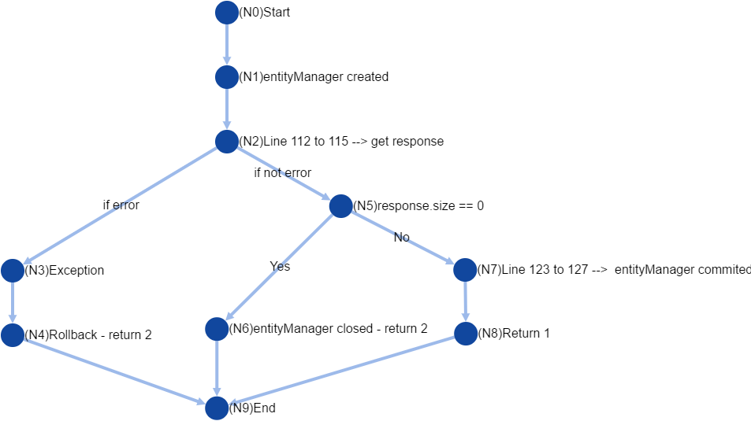

.. default-role:: code

=========================================================================
Robot Framework Project 2nd version by Pablo Sanabria and Juan Diego Diaz
=========================================================================

.. contents:: Table of contents:
   :local:
   :depth: 3

Introduction
============

In this opportunity, we will use graph and logic coverage in methods 
used in the 1st report and in some new methods as well.

About this project
------------------

VideoClub is a JAVA application built using the MVC architecture.
It consists in a store to sell videogames and movies. It was developed
in Bolivia for students from Bolivian Catholic University "San Pablo" from Cochabamba.

Project application
-------------------

We embed a jar with robot framework in our application to automate the testing process.

To build this project you need to use the following command::

    >gradle build

To run this project you need to use the following command::

    >gradle run

To test this project you need to use the following command::

    >gradle runTest

Test Cases
----------

Client Controller
.................

This controller is in charge of creating and deleting clients who are going to buy videogames and movies.

For this controller we stablished the application of graph coverage by nodes. The test cases ahead cover
all the possibilities for code traces.

**Graph for createClient Method:**

.. image:: images/createClient.png
   :width: 40pt

.. list-table::
  :widths: 15
  :header-rows: 1

  * - Test paths needed for Node coverage
  * - [N0,N1,N2,N3,N22]
  * - [N0,N1,N2,N4,N5,N6,N7,N8,N9,N10,N11,N12,N13,N14,N15,N16,N17,N18,N19,N21,N22]
  * - [N0,N1,N2,N4,N5,N6,N7,N8,N9,N10,N11,N12,N13,N14,N15,N16,N17,N18,N19,N20,N22]

**Graph for deleteClient Method:**

.. list-table::
  :widths: 15
  :header-rows: 1

  * - Test paths needed for Node coverage
  * - [N0,N1,N2,N5,N7,N8,N9]
  * - [N0,N1,N2,N5,N6,N9]
  * - [N0,N1,N2,N3,N4,N9]

.. code:: robotframework

   *** Settings ***
   Library  bo.edu.ucbcba.videoclub.controller.ClientController  WITH NAME  client

   *** Variables ***
   ${FIRST_NAME TOO LONG}   First Name is too long, must have less than 25 characters
   ${FIRST_NAME TOO SHORT}  First Name is too short, must have more than 2 characters
   ${FIRST_NAME BLANK}      First Name can't be blank
   ${LAST_NAME TOO LONG}    Last Name is too long, must have less than 25 characters
   ${LAST_NAME TOO SHORT}   Last Name is too short, must have more than 2 characters
   ${LAST_NAME BLANK}       Last Name can't be blank
   ${CI TOO LONG}		       CI can't have more than 10 characters
   ${CI TOO SHORT}		    CI can't have less than 7 characters
   ${CI BLANK}              CI can't be blank
   ${ALREADY CLIENT}		    Already exist a Client with CI:
   ${BLANK}

   *** Test Cases ***
   #### Create Client Method
   #### Here we cover all test paths going to error
   #### Test path passing through N3 and N21 
   
   Creating client with blank first name should fail
       Create client with invalid first name   ${BLANK}    ${FIRST_NAME BLANK}

   Creating client with long first name should fail
       Create client with invalid first name   jhonsnowrickrobotclarkkenthor   ${FIRST_NAME TOO LONG}

   Creating client with short first name should fail
       Create client with invalid first name   k   ${FIRST_NAME TOO SHORT}

   Creating client with blank last name should fail
       Create client with invalid last name    ${BLANK}    ${LAST_NAME BLANK}

   Creating client with long last name should fail
       Create client with invalid last name    hawkingsnowrickrobotclarkkenthor    ${LAST_NAME TOO LONG}

   Creating client with short last name should fail
       Create client with invalid last name    D   ${LAST_NAME TOO SHORT}

   Creating client with blank CI should fail
       Create client with invalid CI  ${BLANK}    ${CI_BLANK}

   Creating client with long CI should fail
       Create client with invalid CI  12929388177    ${CI TOO LONG}

   Creating client with short CI should fail
       Create client with invalid CI  123    ${CI TOO SHORT}
       
   Creating client already exists should fail
       Create client duplicated  111111114  ${ALREADY CLIENT}
       
   #######################################################
   
   #### Here we covered test paths going successfully (N20)
   
   Creating client with valid information
       ${clients} =    Count clients
       Create client  1299456745  juan_d  perez  nowhere
       ${clients_new} =    Count clients
       ${diff} =   Evaluate    $clients_new-$clients
       Should Be Equal As Integers     ${diff}  1

   #######################################################
   
   #### Delete Client Method
   #### Here we covered test paths failed (N20)
   
   Delete non existent client
       ${response} =   client.deleteClient    123
       Should Be Equal As Integers    ${response}     2

   ########################################################
   
   #### Here we covered test paths going successfully (N8)

   Delete existent client
       Create client  1299456746  juan_d  perez  nowhere
       ${clients} =    Count clients
       ${response} =   client.deleteClient    1299456746
       Should Be Equal As Integers    ${response}     1
       ${clients_new} =    Count clients
       ${diff} =   Evaluate    $clients_new-$clients
       Should Be Equal As Integers     ${diff}  -1

   *** Keywords ***
   Create client with invalid first name
       [Arguments]    ${firstname}    ${error}
       ${message} =  Run Keyword And Expect Error	*  client.create  12345678  ${firstname}  hawking  nowhere
       log  ${message}
       Should Be Equal  ${message}  ValidationException: Validation error: ${error}

   Create client with invalid last name
       [Arguments]    ${lastname}    ${error}
       ${message} =  Run Keyword And Expect Error  *  client.create  12345678  jhon_doe  ${lastname}  nowhere
       log  ${message}
       Should Be Equal  ${message}  ValidationException: Validation error: ${error}

   Create client with invalid CI
       [Arguments]    ${ci}    ${error}
       ${message} =  Run Keyword And Expect Error	*  client.create  ${ci}  jhon_doe  hawking  nowhere
       log  ${message}
       Should Be Equal  ${message}  ValidationException: Validation error: ${error}

   Create client
       [Arguments]  ${ci}  ${firstname}  ${lastname}  ${address}
       ${message} =  client.create  ${ci}  ${firstname}  ${lastname}  ${address}
       log  ${message}
       Should Be Equal  ${message}  ${None}

   Create client duplicated
       [Arguments]  ${ci}  ${error}
       deleteClient    ${ci}
       client.create  ${ci}  jhon_doe  hawking  nowhere
       ${message} =    Run Keyword And Expect Error  *  client.create  ${ci}  jhon_doe  hawking  nowhere
       log  ${message}
       Should Be Equal  ${message}  ValidationException: Validation error: ${error} '${ci}'

   Count clients
       ${clients} =    client.searchClient  ${EMPTY}
       ${size} =   Get Length   ${clients}
       [Return]    ${size}

Company Controller
..................

This controller is in charge of creating companies which are going to be used in the software.

.. code:: robotframework

    *** Settings ***
    Library  bo.edu.ucbcba.videoclub.controller.CompanyController  WITH NAME  company

    *** Variables ***
    ${COMPANY NAME TOO LONG}       Name is too long, must have less than 25 characters
    ${COMPANY COUNTRY TOO LONG}    Country is too long, must have less than 25 characters
    ${COMPANY NAME BLANK}  	       Name can't be blank
    ${COMPANY COUNTRY BLANK}       Country can't be blank
    ${ALREADY COMPANY}             Company already exists
    ${BLANK COMPANY}

    *** Test Cases ***
    Creating company with invalid name should fail
        Create company with invalid name  hawkingsnowrickrobotclarkkenthor  ${COMPANY NAME TOO LONG}

    Creating company with invalid country should fail
        Create company with invalid country  hawkingsnowrickrobotclarkkenthor  ${COMPANY COUNTRY TOO LONG}

    Creating company with blank first name should fail
        Create company with invalid name	${BLANK COMPANY}    ${COMPANY NAME BLANK}

    Creating company already exist should fail
        Create company already exist	detodo	colombia

    *** Keywords ***

    Create company with invalid name
        [Arguments]    ${name}    ${error}
        ${message} =  Run Keyword And Expect Error  *  company.create  ${name}  bolivia
        log  ${message}
        Should Be Equal  ${message}  ValidationException: Validation error: ${error}

    Create company with invalid country
        [Arguments]    ${country}    ${error}
        ${message} =  Run Keyword And Expect Error  *  company.create  detodo.com  ${country}
        log  ${message}
        Should Be Equal  ${message}  ValidationException: Validation error: ${error}

    Create company already exist
        [Arguments]    ${name}    ${country}
        company.create  ${name}  ${country}
        ${message} =  Run Keyword And Expect Error  *  company.create  ${name}  ${country}
        log  ${message}
        Should Be Equal  ${message}  ValidationException: Validation error: ${ALREADY COMPANY}

User Controller
...............

This controller is in charge of creating users who are going to use the differents features of the software.

**Graph for changePassword Method:**

.. image:: images/changePasswordUser.png
   :width: 40pt

.. list-table::
  :widths: 15
  :header-rows: 1

  * - Test paths needed for Node coverage
  * - [N0,N1,N2,N10]
  * - [N0,N1,N3,N4,N5,N7,N8,N10]
  * - [N0,N1,N3,N4,N5,N6,N9,N10]

.. code:: robotframework

    *** Settings ***
    Library  bo.edu.ucbcba.videoclub.controller.UserController  WITH NAME  user

    *** Variables ***
    ${USER NAME TOO LONG}        	 Username is too long, must have less than 10 characters
    ${USER PASSWORD TOO LONG}    	 Password is too long, must have less than 25 characters
    ${USER NAME TOO SHORT}       	 Username is too short, must have more than 4 characters
    ${USER PASSWORD TOO SHORT}   	 Password is too short, must have more than 6 characters
    ${USER NAME ONLY NUMBERS}        Username can't be only a number, must have letters
    ${USER PASSWORD ONLY NUMBERS}    Password can't be only a number, must have letters
    ${USER PASSWORD ONLY LETTERS}    Password can't be only a letters, must have numbers
    ${USER NAME BLANK}  	     	 Username can't be blank
    ${USER PASSWORD BLANK}       	 Password can't be blank
    ${ALREADY USER}              	 Username already exist
    ${BLANK USER}

    *** Test Cases ***
    Creating user with invalid username should fail
        [Template]  Create user with invalid username
        hawkingsnowrickrobotclarkkenthor  ${USER NAME TOO LONG}
        jd  ${USER NAME TOO SHORT}
        1234567  ${USER NAME ONLY NUMBERS}
        ${BLANK USER}  ${USER NAME BLANK}

    Creating user with invalid password should fail
        [Template]  Create user with invalid password
        hawkingsnowrickrobotclarkkenthor  ${USER PASSWORD TOO LONG}
        jd  ${USER PASSWORD TOO SHORT}
        1234567  ${USER PASSWORD ONLY NUMBERS}
        helloworld  ${USER PASSWORD ONLY LETTERS}
        ${BLANK USER}  ${USER PASSWORD BLANK}

    Creating user already exist should fail
        Create user already exist     ps123abc   ps123456

    Delete non existent user
        ${response} =   user.deleteUser    jd12345
        Should Be Equal As Integers		${response}     2

    Delete existent user
        Create user  jd4567467  juan12345
        ${users} =    Count users
        ${response} =   user.deleteUser    jd4567467
        Should Be Equal As Integers    ${response}     1
        ${users_new} =    Count users
        ${diff} =   Evaluate    $users_new-$users
        Should Be Equal As Integers     ${diff}  -1

    *** Keywords ***

    Create user with invalid username
        [Arguments]    ${name}    ${error}
        ${message} =  Run Keyword And Expect Error  *  user.create  ${name}  abc123456  2
        log  ${message}
        Should Be Equal  ${message}  ValidationException: Validation error: ${error}

    Create user already exist
        [Arguments]    ${name}    ${password}
        user.create  ${name}  ${password}  2
        ${message} =  Run Keyword And Expect Error  *  user.create  ${name}  ${password}  2
        log  ${message}
        Should Be Equal  ${message}  ValidationException: Validation error: ${ALREADY USER}

    Create user with invalid password
        [Arguments]   ${password}  ${error}
        ${message} =  Run Keyword And Expect Error  *   user.create  jd123ab  ${password}  2
        log  ${message}
        Should Be Equal  ${message}  ValidationException: Validation error: ${error}

    Create user
        [Arguments]  ${username}  ${password}
        ${message} =  user.create  ${username}  ${password}  2
        log  ${message}
        Should Be Equal  ${message}  ${None}

    Count users
        ${users} =    user.searchUser  ${EMPTY}
        ${size} =   Get Length   ${users}
        [Return]    ${size}

Directors Controller
....................

This controller is in charge of creating directors for the movies that the software needs for movies

**Graph for createDirector Method:**

.. list-table::
  :widths: 15
  :header-rows: 1

  * - Test paths needed for Node coverage
  * - [N0,N1,N2,N3,N9]
  * - [N0,N1,N2,N4,N5,N6,N7,N8,N9]

**Graph for updateDirector Method:**

.. list-table::
 :widths: 15
 :header-rows: 1

 * - Test paths needed for Node coverage
 * - [N0,N1,N2,N3,N9]
 * - [N0,N1,N2,N4,N5,N6,N7,N8,N9]

.. code:: robotframework

    *** Settings ***

    Library     bo.edu.ucbcba.videoclub.controller.DirectorController  WITH NAME   director

    *** Variables ***
    ${FIRST_NAME_BLANK_DIR}     First Name can't be blank
    ${LAST_NAME_BLANK_DIR}      Last Name can't be blank
    ${FIRST_NAME_LONG_DIR}      First Name is too long, must have less than 25 characters
    ${LAST_NAME_LONG_DIR}       Last Name is too long, must have less than 25 characters
    ${DIR_ALREADY_EXISTS}       director already exists
    ${BLANK}

    *** Test Cases ***
    Create director with blank first name
        Create director with invalid name   ${BLANK}    ${FIRST_NAME_BLANK_DIR}

    Create director with long first name
        Create director with invalid name   ajsdhkjashdjkhaskjdhkjashdkjashddkjsahd    ${FIRST_NAME_LONG_DIR}

    Create director with blank last name
        Create director with invalid last name   ${BLANK}    ${LAST_NAME_BLANK_DIR}

    Create director with long last name
        Create director with invalid last name  ajsdhkjashdjkhaskjdhkjashdkjashddkjsahd    ${LAST_NAME_LONG_DIR}

    Create valid director
        ${size1} =   Directors count
        Create director     Stanley     Kubrik
        ${size2} =  Directors count
        ${diff} =   Evaluate    $size2-$size1
        Should Be Equal As Integers     ${diff}  1

    Create repeated director
        Create director     David      Cronenberg
        ${size1} =   Directors count
        ${message} =    Run Keyword And Expect Error    *     Create director     David      Cronenberg
        Should Be Equal  ${message}  ValidationException: Validation error: ${DIR_ALREADY_EXISTS}
        ${size2} =  Directors count
        ${diff} =   Evaluate    $size2-$size1
        Should Be Equal As Integers     ${diff}  0

    *** Keywords ***
    Create director with invalid name
        [Arguments]    ${name}    ${error}
        ${message} =  Run Keyword And Expect Error  *  director.saveDirector  ${name}  Jackson
        log  ${message}
        Should Be Equal  ${message}  ValidationException: Validation error: ${error}

    Create director with invalid last name
        [Arguments]    ${name}    ${error}
        ${message} =  Run Keyword And Expect Error  *  director.saveDirector  Peter     ${name}
        log  ${message}
        Should Be Equal  ${message}  ValidationException: Validation error: ${error}

    Create director
        [Arguments]     ${firstName}    ${lastName}
        ${message} =    director.saveDirector   ${firstName}    ${lastName}
        [Return]   ${message}

    Directors count
        ${directors} =  director.getAlldirectors
        ${size} =   Get Length   ${directors}
        [Return]    ${size}

Games Controller
................

This controller is in charge of creating games for the store.

**Graph for searchGame Method:**

.. image:: images/searchGame.png
   :width: 40pt

.. list-table::
  :widths: 15
  :header-rows: 1

  * - Test paths needed for Node coverage
  * - [N0,N1,N14,N15,N17,N18,N19,N20]
  * - [N0,N1,N14,N15,N16,N18,N19,N20]
  * - [N0,N1,N2,N3,N5,N18,N19,N20]
  * - [N0,N1,N2,N3,N4,N18,N19,N20]
  * - [N0,N1,N6,N7,N9,N18,N19,N20]
  * - [N0,N1,N6,N7,N8,N18,N19,N20]
  * - [N0,N1,N10,N11,N13,N18,N19,N20]
  * - [N0,N1,N10,N11,N12,N18,N19,N20]

.. code:: robotframework

    *** Settings ***

    Library     bo.edu.ucbcba.videoclub.controller.GameController  WITH NAME   game
    Library     bo.edu.ucbcba.videoclub.controller.CompanyController  WITH NAME   company

    *** Variables ***
    ${FIRST_NAME_BLANK_DIR}     First Name can't be blank
    ${LAST_NAME_BLANK_DIR}      Last Name can't be blank
    ${FIRST_NAME_LONG_DIR}      First Name is too long, must have less than 25 characters
    ${LAST_NAME_LONG_DIR}       Last Name is too long, must have less than 25 characters
    ${DIR_ALREADY_EXISTS}       director already exists
    ${BLANK}
    ${c}                        Create company param

    *** Test Cases ***
    Search games order by year ASC
        Search games   gameone1    Year    Ascendant
        
    Search games order by year DESC
        Search games   gameone2    Year    Descendant
        
    Search games order by company ASC
        Search games   gameone3    Company    Ascendant
        
    Search games order by company DESC
        Search games   gameone4    Company    Descendant
        
    Search games order by rating ASC
        Search games   gameone5    Rating    Ascendant                

    Search games order by rating DESC
        Search games   gameone6    Rating    Descendant
        
    Search games order by price ASC
        Search games   gameone7    Price    Ascendant                

    Search games order by price DESC
        Search games   gameone8    Price    Descendant        

    *** Keywords ***
    Create game
        [Arguments]     ${title}    ${description}  ${releaseYear}  ${rating}   ${price}    ${company}
        Run Keyword And Expect Error  *  game.create  ${title}    ${description}  ${releaseYear}  ${rating}   ${price}    ${company}
    
    Create company param
        company.create  "Test2"  "Uruguay"
        ${list} =   company.getAllCompanies
        [Return]    ${list}.get     0
    
    Search games
        [Arguments]    ${query}    ${order}    ${sence} 
        Create game     ${query}    Any    2011    4   11.0  ${c}
        ${message} =  game.searchGames  ${query}    ${order}    ${sence}
        log  ${message}
        Should Be Empty  ${message}
        
        

Test Cases with Logic Coverage
------------------------------
Games controller
----------------
This controller was tested using a RACC logic coverage, details about the truth table
and the expression are on `This page <gacc_create_game.html>`
The detailed expressions are listed below:

- A: description.isEmpty()
- B: releaseYear.isEmpty()
- C: price.isEmpty()
- D: title.isEmpty()
- E: releaseYear.matches("[0-9]+")
- F: price.matches("[0-9]+")
- G: year <= releaseYear
- H: year >= 1947
- I: title.length > 100
- J: description.length > 250
- K: validatePresence(title) > 0

The final expression is: A | B | C | D | !E | !F | !(G & H) | I | J | K
The tests are:

.. code:: robotframework

    *** Settings ***

    Library     bo.edu.ucbcba.videoclub.controller.GameController  WITH NAME   game
    Library     bo.edu.ucbcba.videoclub.controller.CompanyController  WITH NAME   company
    Library     String
    Library     Collections

    *** Variables ***

    ${BLANK}

    *** Test Cases ***

    # Case 1928
    Create valid game
        Create valid game     Game name    Test    1991    2   10

    # Case 1800
    Create game with blank name
        Create invalid game     ${BLANK}    Test    1991    2   10

    # Case 904
    Create game with blank description
        Create invalid game     Game name   ${BLANK}    1991    2   10

    # Case 1672
    Create game with empty price
        Create invalid game     Game name   Test    1991    2   ${BLANK}

    # Case 1416
    Create game with empty release year
        Create invalid game     Game name   Test    ${BLANK}    2   10

    *** Keywords ***
    Create valid game
        [Arguments]     ${title}    ${description}  ${releaseYear}  ${rating}   ${price}
        ${company} =    Create company
        game.create  ${title}    ${description}  ${releaseYear}  ${rating}   ${price}    ${company}
        ${response} =   game.validatePresence   ${title}
        Should Be Equal As Integers     1   ${response}

    Create invalid game
        [Arguments]     ${title}    ${description}  ${releaseYear}  ${rating}   ${price}
        ${company} =    Create company
        Run Keyword And Expect Error  *  game.create  ${title}    ${description}  ${releaseYear}  ${rating}   ${price}    ${company}

    Create company
        ${name} =   Generate Random String
        company.create  ${name}  Chile
        ${list} =   company.getAllCompanies
        ${company} =    Get From List   ${list}     -1
        [Return]    ${company}

Conclusions
-----------

We used graphs with node coverage because it seems to be the option with less test paths in all the cases.
In some methods we applied logic coverage aiming for better understanding about Coverage criteria strategies.

While we were doing this report, we consider that all the process aforementioned could be a bit much for 
this project (VideoClub). However, this could be a great approach for bigger applications.

 

